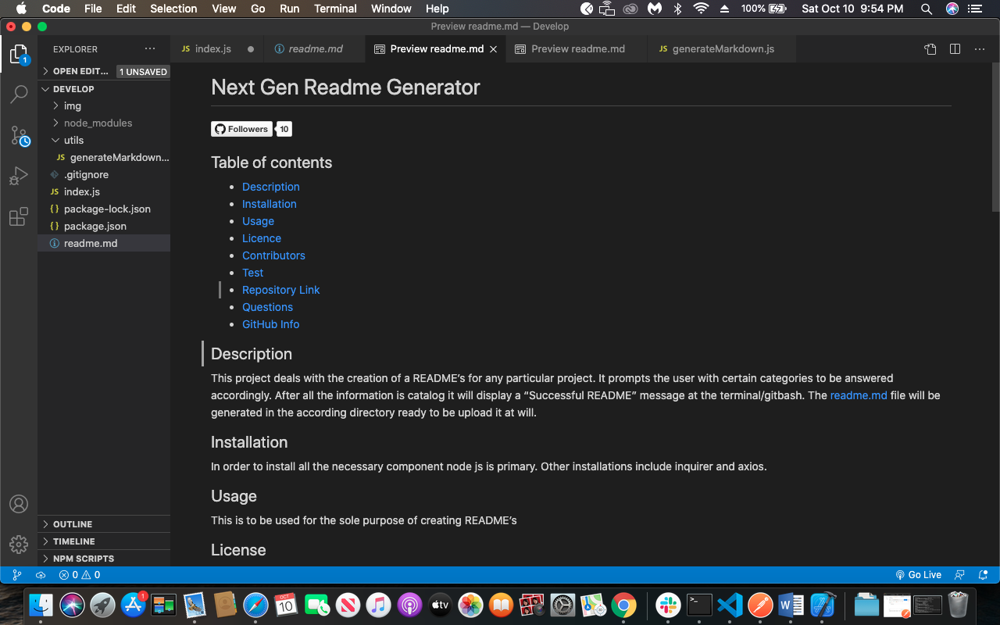
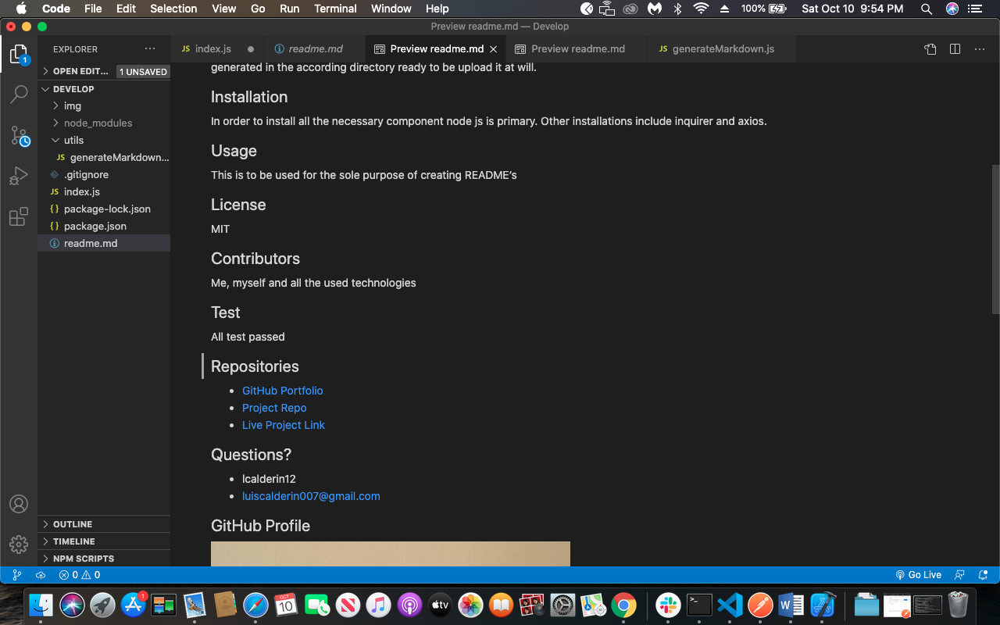

# Next Gen Readme Generator
  
  
# Video Link
[vid Link](https://drive.google.com/file/d/1NKLx2eUmlo894za0nCIFyxAJFyuYjIg_/view)

# Screenshots

## Table of contents
- [Description](#Description)
- [Installation](#Installation)
- [Usage](#Usage)
- [Licence](#Licence)
- [Contributors](#Contributors)
- [Test](#Test)
- [Repository Link](#Repositories)
- [Questions](#Questions?)
- [GitHub Info](#GitHub) 
## Description 
This project deals with the creation of a README’s for any particular project. It prompts the user with certain categories to be answered accordingly. After all the information is catalog it will display a “Successful README” message at the terminal/gitbash. The readme.md file will be generated in the according directory ready to be upload it at will. 
## Installation
In order to install all the necessary component Node js is primary. Other installations include inquirer and axios npm’s
## Usage
This is to be used for the sole purpose of creating README’s
## License
MIT
## Contributors
Me, myself and all the used technologies
## Test
All test passed!
## Repositories
- [GitHub Portfolio](https://github.com/lcalderin12)
- [Project Repo](https://github.com/lcalderin12/Next-Gen-README-Generator)
## Questions?
- lcalderin12
- luiscalderin007@gmail.com
## GitHub Profile

- Luis Calderin
